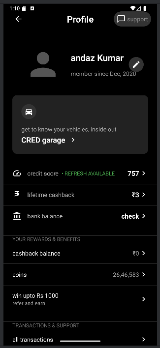

# ProfileApp

A modern Android application featuring a sleek profile UI interface.

## Features

- Dark-themed profile screen with modern UI elements
- User profile information display with profile picture
- Vehicle information card with CRED garage integration
- Financial section displaying credit score, cashback, and bank balance
- Rewards and benefits section with coins and referral program
- Transaction history section

## Technologies Used

- Kotlin programming language
- Android View system with XML layouts
- Jetpack Compose for hosting the view
- Material Design components
- CircleImageView for circular profile images

## Screenshot

## Getting Started

### Prerequisites

- Android Studio Electric Eel or newer
- Minimum SDK: Android 24 (7.0 Nougat)
- Target SDK: Android 34

### Installation

1. Clone this repository
2. Open the project in Android Studio
3. Sync Gradle files
4. Run on an emulator or physical device

## Credits

This project was created as a demonstration of modern Android UI implementation.